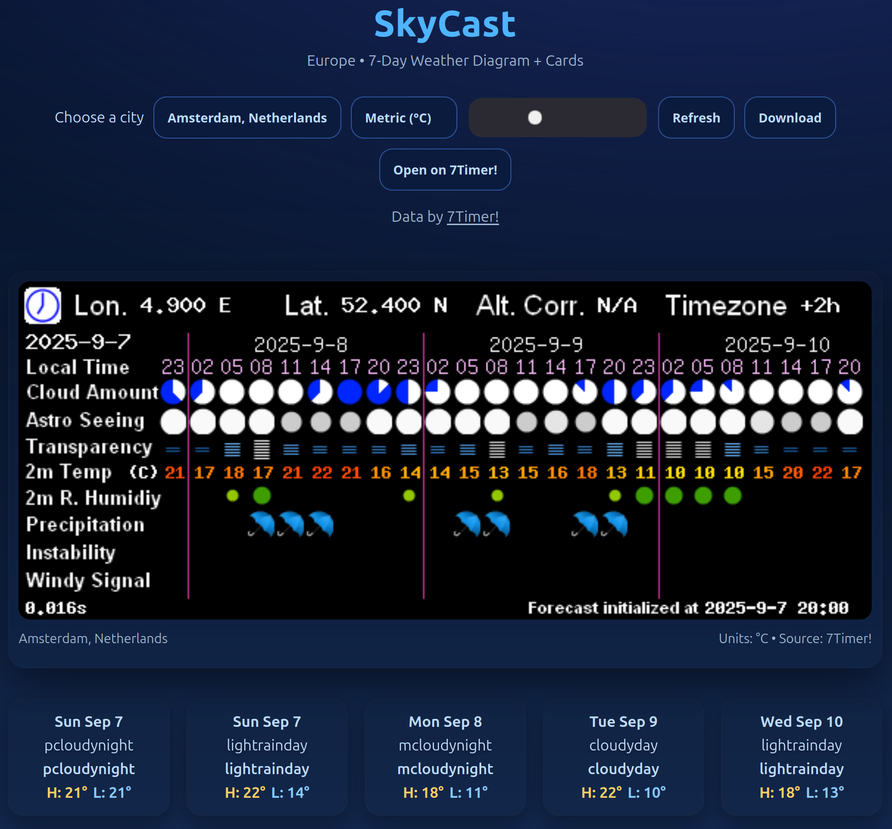
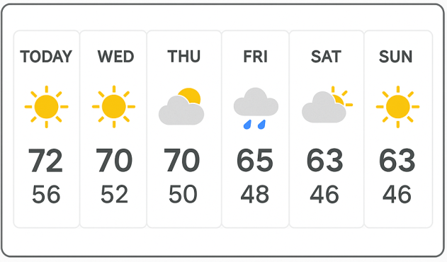
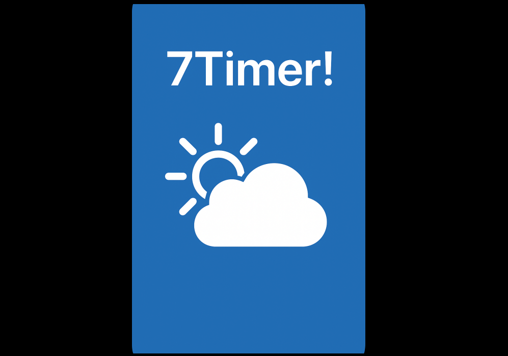

# SkyCast — European Weather Viewer

A responsive weather application that presents a seven-day forecast for major European cities using the public 7Timer! weather service. SkyCast combines forecast diagrams with readable daily cards so users can understand conditions quickly.

## Live Application

**[Open SkyCast](https://parbproject.github.io/skycast/)**

## Highlights

- Seven-day forecasts for major European cities
- Daily high/low temperatures and condition summaries
- Graphical forecast diagrams supplied by 7Timer!
- Responsive browser-based interface
- No API key, backend, or build process required

## Preview

  

  

  

## Technical Approach

| Area | Implementation |
|---|---|
| Interface | HTML, CSS, JavaScript |
| Weather data | 7Timer! public API |
| Deployment | GitHub Pages |
| Runtime | Client-side browser application |

## Run Locally

~~~bash
git clone https://github.com/ParBproject/skycast.git
cd skycast
python -m http.server 8000
~~~

Open http://localhost:8000 in a browser.

## Project Structure

~~~text
skycast/
├── index.html
├── european_weather_forecast.html
├── SC/
├── CONTRIBUTING.md
└── LICENSE
~~~

## Skills Demonstrated

API integration, responsive UI development, asynchronous data handling, error-tolerant presentation, and static-site deployment.

## Credits

Weather data and forecast diagrams are provided by [7Timer!](https://www.7timer.info/).
