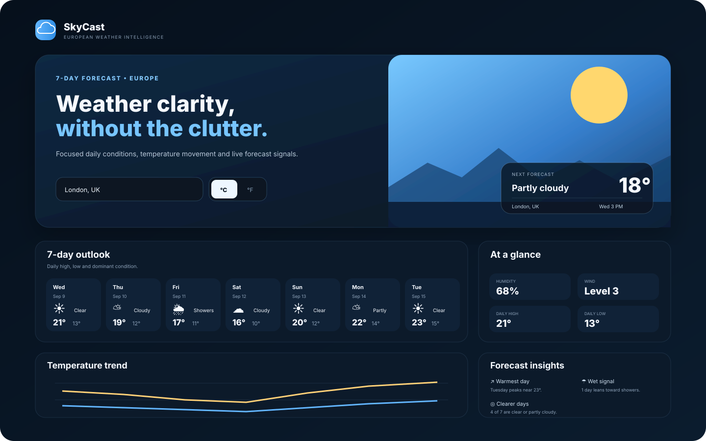
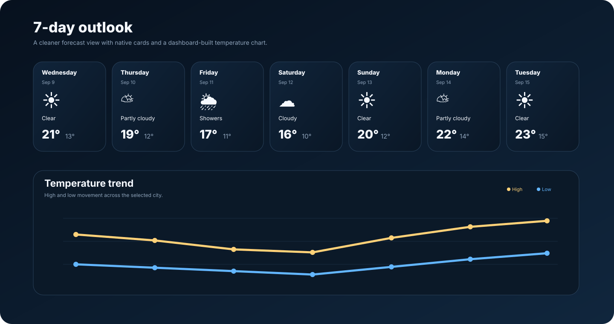

# SkyCast — European Weather Dashboard

[](https://github.com/ParBproject/skycast/actions/workflows/quality.yml)
[](https://parbproject.github.io/skycast/)
[](https://parbproject.github.io/skycast/)
[](https://parbproject.github.io/skycast/)
[](LICENSE)

<p align="center">
  <a href="https://parbproject.github.io/skycast/">
    
  </a>
</p>

<p align="center">
  <strong>An installable, resilient weather intelligence dashboard for major European cities.</strong><br>
  Current conditions • Next 12 hours • 7-day forecast • Offline fallback • Native SVG visualization
</p>

<p align="center">
  <a href="https://parbproject.github.io/skycast/"><strong>Open Live Dashboard →</strong></a>
</p>

SkyCast turns live Open-Meteo forecast data into a focused weather data product. It combines current conditions, a 12-hour outlook, seven-day planning, precipitation and wind signals, daylight details, temperature trends, dynamic weather artwork, installability, and last-known-data fallback in a dependency-free client-side application.

## Product Highlights

- Current modeled conditions for 22 major European cities
- Next-12-hours forecast with temperature, weather condition, precipitation probability, and wind
- Seven-day high/low temperatures and WMO weather-code summaries
- Precipitation probability, cloud cover, humidity, wind speed, gusts, and apparent temperature
- Local sunrise/sunset details and timezone-aware forecast timestamps
- Celsius/Fahrenheit switching with matching wind and precipitation units
- Native SVG high/low temperature trend chart rendered in the browser
- Dynamic hero artwork for clear, cloudy, rainy, and snowy weather
- Forecast insight cards for warmest, wettest, windiest, and clearer days
- Installable Progressive Web App manifest and service worker
- Offline application shell plus a 24-hour last-successful-forecast cache per city/unit
- Request cancellation to prevent stale results when users switch cities quickly
- Loading states, API failure handling, persistent preferences, reduced-motion support, and keyboard focus states
- Fully client-side deployment with no framework, backend, API key, or runtime dependency

## Forecast Experience

<p align="center">
  
</p>

## Data Architecture

SkyCast uses the Open-Meteo Forecast API directly from the browser. One request returns current, hourly, and daily weather data. The response is validated and normalized into a small internal model shared by the dashboard renderers and the offline last-known-data cache.

```text
Open-Meteo Forecast API
          │
          ▼
 fetch + AbortController
          │
          ▼
   payload validation
          │
          ▼
      normalization ───────────────┐
          │                        │
     ┌────┼───────────┐            ▼
     ▼    ▼           ▼       localStorage
 current  12-hour   7-day      forecast cache
 metrics  outlook   forecast         │
                  ┌──┴──┐             │
                  ▼     ▼             │
                chart  insights ◀─────┘
```

A same-origin service worker separately caches the application shell and local weather artwork. If the network or live weather service is unavailable, the page can still load and SkyCast attempts to render the most recent compatible forecast cached for the selected city and unit.

The app uses WMO weather codes instead of provider-specific condition strings, keeping presentation logic explicit and testable.

## Progressive Web App

SkyCast includes:

- `manifest.webmanifest` for standalone installation metadata
- `assets/app-icon.svg` as the application icon
- `sw.js` with versioned application-shell caching
- install-prompt handling in supported browsers
- cache cleanup when a new service-worker shell version activates
- offline navigation fallback to the cached dashboard shell
- a separate application-level forecast cache with a 24-hour TTL

The service worker intentionally caches only same-origin static requests. Live Open-Meteo responses remain controlled by the application data layer so stale weather data is surfaced explicitly as cached rather than silently presented as live.

## Technical Approach

| Area | Implementation |
|---|---|
| Interface | Semantic HTML, responsive CSS, vanilla JavaScript |
| Weather data | Open-Meteo Forecast API |
| Current conditions | Temperature, apparent temperature, humidity, cloud cover, wind, gusts, weather code |
| Hourly forecast | Next 12 hours of temperature, apparent temperature, rain probability, condition, and wind |
| Daily forecast | High/low temperature, precipitation probability, wind, gusts, sunrise/sunset, weather code |
| Visualization | Native SVG temperature chart generated from live data |
| Visual system | Lightweight local SVG weather scenes |
| State | `localStorage` for selected city, temperature unit, and last-successful forecast cache |
| Request safety | `AbortController` + sequence guard against stale responses |
| Offline shell | Versioned Service Worker + Cache Storage |
| Installability | Web App Manifest + browser install prompt handling |
| Validation | Python `unittest` regression checks with no third-party dependencies |
| CI | GitHub Actions on pushes, pull requests, and manual runs |
| Deployment | GitHub Pages |
| Runtime | Fully client-side; no build process required |

## Quality Checks

The zero-dependency regression suite verifies both the weather dashboard and PWA layer:

- Required dashboard regions and controls remain present
- Open-Meteo remains the configured production weather provider
- Local HTML/SVG asset references resolve
- All four condition-aware hero assets exist
- The 22-city catalog remains complete and duplicate-free
- README preview assets remain valid
- The legacy forecast URL still redirects to the main dashboard
- The manifest is valid, standalone, scoped correctly, and references existing icons
- The service worker precaches the required shell assets
- The service worker limits runtime caching to same-origin GET requests
- The app registers the service worker and handles install prompts
- The hourly forecast request and renderer remain connected
- The last-known forecast cache retains its TTL guard

Run the checks locally with:

```bash
python -m unittest discover -s tests -v
```

## Project Structure

```text
skycast/
├── .github/
│   └── workflows/
│       └── quality.yml
├── assets/
│   ├── app-icon.svg
│   ├── hero-clear.svg
│   ├── hero-cloud.svg
│   ├── hero-rain.svg
│   └── hero-snow.svg
├── SC/
│   ├── skycast-dashboard-2026.svg
│   └── skycast-forecast-2026.svg
├── tests/
│   ├── test_project.py
│   └── test_pwa.py
├── index.html
├── manifest.webmanifest
├── sw.js
├── european_weather_forecast.html
├── CONTRIBUTING.md
└── LICENSE
```

## Run Locally

```bash
git clone https://github.com/ParBproject/skycast.git
cd skycast
python -m http.server 8000
```

Open `http://localhost:8000` in a browser. Service workers are available on `localhost`; for production the project is served over HTTPS by GitHub Pages.

## Skills Demonstrated

API integration, asynchronous JavaScript, payload validation, hourly/daily weather normalization, race-condition prevention, WMO weather-code mapping, SVG data visualization, responsive product UI, PWA architecture, service workers, browser caching, offline fallback design, local-state persistence, accessibility-aware frontend design, automated regression testing, CI/CD, graceful error handling, and static-site deployment.

## Credits

Weather forecast data is provided by [Open-Meteo](https://open-meteo.com/). Dashboard interface, data normalization, caching strategy, data visualization, tests, and visual assets are maintained in this repository.
