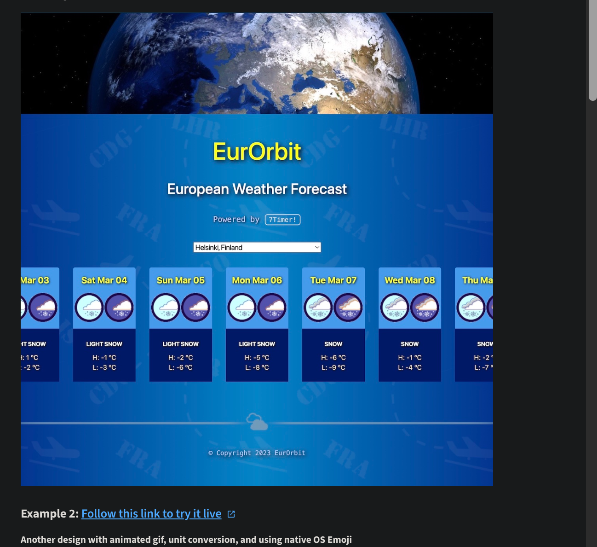
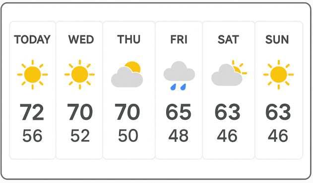
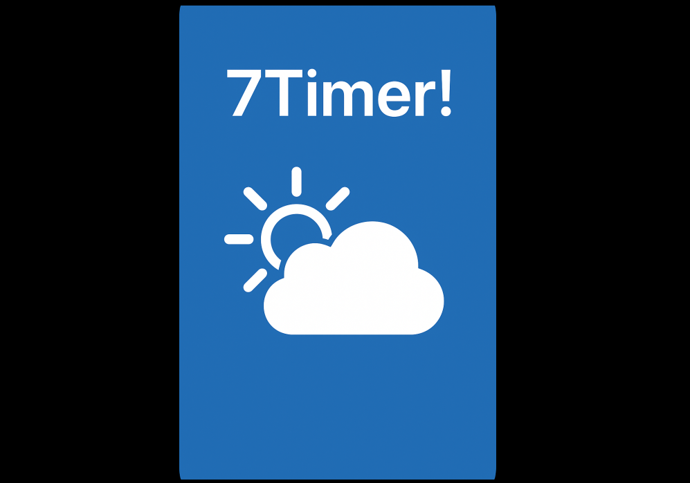

# SkyCast – European Weather Viewer

For the whole experience, visit project at:   https://parbproject.github.io/skycast/  

SkyCast is a simple web project that shows a **7‑day weather forecast** for major European cities using the free [7Timer! API](https://www.7timer.info/).

It combines:
- The **graphical forecast diagram (PNG)** from 7Timer!
- **Daily forecast cards** with icons, summaries, and high/low temperatures.

---

## 📸 Screenshots

### Home Page
<p align="center">
  <br>
   
<p align="center">
  <br>

### Forecast Diagram
<p align="center">
  <br>

   
### Daily Cards
<p align="center">
  <br>
---

---

## 🚀 Live Demo
Once published with GitHub Pages, your project will be live at:
```
https://<your-username>.github.io/skycast/
```

---

## 📂 Project Structure
```
skycast/
├─ index.html        # main webpage
├─ icons/            # weather icons (PNG/SVG)
│  ├─ sun.png
│  ├─ partly_cloudy.png
│  ├─ rain.png
│  └─ ...
└─ screenshot.png    # optional screenshot for README
```

---

## ⚙️ Setup (local)
1. Clone or download this repo.
2. Open the folder in **Visual Studio Code**.
3. Install the **Live Server** extension.
4. Right‑click `index.html` → **Open with Live Server**.
5. The app will open at `http://127.0.0.1:5500/`.

---

## 🌍 Deployment with GitHub Pages
1. Push this project to a **public GitHub repo**.
2. Go to **Settings → Pages**.
3. Source: `Deploy from branch` → `main` branch → root folder.
4. Save, then open the generated URL:  
   `https://<your-username>.github.io/skycast/`

---

## 🙌 Credits
Par Bah
- Weather data & diagrams: [7Timer!](https://www.7timer.info/)
- Icons: custom flat weather set
- Built with HTML, CSS, and JavaScript

---

© 2025 SkyCast • Educational project
